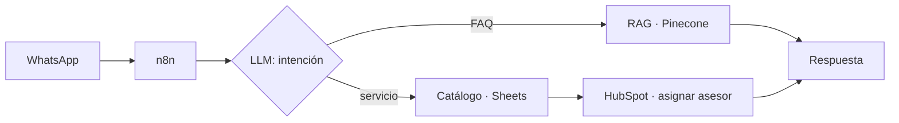

  

  

  
  
  
  

  

Soy **desarrollador full stack** en el área de **Sistemas y Desarrollo de Avalúos ANEPSA**. Construyo desde la interfaz que usa el equipo hasta la lógica de backend, las integraciones y los agentes de IA que trabajan detrás. Convierto procesos operativos en sistemas: flujos orquestados, agentes de IA y paneles que la operación usa todos los días. Me encargo de todo el ciclo: entiendo el proceso con quien lo opera, lo diseño, lo construyo, lo audito con datos reales y lo dejo documentado.

| | |
|---|---|
| **⚡ Orquestación de procesos** Workflows en n8n self-hosted que conectan WhatsApp, CRM, APIs internas y modelos de IA, con patrones asíncronos, validación y manejo de errores. | **🧠 Agentes de IA y LLMs** Clasificación de intención, extracción estructurada, RAG con Pinecone y optimización de costo con prompt caching y salidas con esquema. |
| **💬 CRM y mensajería** HubSpot + WhatsApp Business: búsqueda multicampo de contactos, clasificación por unidad de negocio y ruteo automático al asesor correcto. | **🧩 Desarrollo full stack** Frontend en React, backend en Node.js con MongoDB, APIs REST y contenedores con Docker: módulos completos del sistema interno, del levantamiento y el mockup a producción. |
| **📊 Dashboards y datos** Paneles de seguimiento comercial para Mesa de Control y Dirección, con filtros, indicadores de cierre y exportación. | **📐 Análisis de procesos** Traduzco reglas de negocio (costeo, viáticos, cotización) en lógica formal, fórmulas auditables y roadmaps de automatización. |
| **📄 Documentación técnica** Manuales, guías de migración y documentación de workflows en producción, incluso por ingeniería inversa. | |

> 🟢 producción  ·  🟡 en desarrollo  ·  🟣 análisis / diseño

| | Proyecto | Qué hace | Stack |
|:-:|---|---|---|
| 🟢 | **Asistente de WhatsApp con IA** | Atiende prospectos, responde FAQ con RAG, perfila el servicio y registra y asigna el lead en HubSpot. Fase 2 diseñada: multiagente con expediente persistente. | `n8n` `OpenAI` `Pinecone` `HubSpot` |
| 🟡 | **Cotizador de viáticos** | Itinerarios por tramos con cinco topologías de viaje, búsqueda de hospedaje con filtro geográfico y auditoría determinista que recalcula cada cotización. | `n8n` `Apify` `Distance Matrix` |
| 🟢 | **Módulo de Órdenes de Trabajo** | Del levantamiento de requerimientos y mockup funcional a la integración back/front y producción en el sistema interno. | `Internal Control` `Jira` |
| 🟢 | **Cotizadores Autos y Placas** | Extraen datos con IA, consultan HubSpot, estiman valor de mercado y generan la cotización en PDF vía API interna. | `n8n` `OpenAI` `SerpApi` |
| 🟡 | **Plataforma comercial** | Seguimiento de cotizaciones, Mesa de Control y vista de Dirección con filtros por vendedor e indicadores de cierre. | `React` `JSX` |
| 🟣 | **Motor de costeo industrial** | Análisis funcional de la memoria de cálculo: nueve etapas, tres métodos de costeo y roadmap de automatización. | `Excel` `Modelado` |

Proyectos internos de la empresa; el código no es público.

<b>⚡ Ver el flujo del asistente de WhatsApp</b>

<code>frontend</code> 
  
  
  
  

<code>backend, bases de datos y devops</code> 
  
  
  
  
  
  

<code>automatización e ia</code> 
  
  
  
  

<code>crm y mensajería</code> 
  
  
  
  
  

<code>datos e integraciones</code> 
  
  
  
  
  

<code>herramientas</code> 
  
  
  

  

  
  

<code>¿Tienes un proceso que debería funcionar solo? Hablemos.</code>

