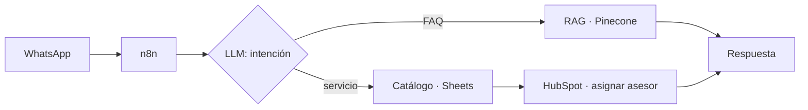

<p align="center">
  
</p>

<p align="center">
  
</p>

<p align="center">
  
  
  
</p>

<p align="center"></p>

<h2> 01 — Quién soy</h2>

Trabajo en **Sistemas y Desarrollo en Avalúos ANEPSA**, donde convierto procesos operativos en sistemas: flujos orquestados, agentes de IA y paneles que la operación usa todos los días. Me encargo de todo el ciclo: entiendo el proceso con quien lo opera, lo diseño, lo construyo, lo audito con datos reales y lo dejo documentado.

```yaml
rol:        Sistemas y Desarrollo @ Avalúos ANEPSA
enfoque:    automatización · agentes de IA · integración de sistemas
formación:  tesina en proceso — agentes de IA y orquestación de procesos
ubicación:  México
```

<p align="center"></p>

<h2> 02 — Lo que sé hacer</h2>

| | |
|---|---|
| **⚙️ Orquestación de procesos**<br/>Workflows en n8n self-hosted que conectan WhatsApp, CRM, APIs internas y modelos de IA, con patrones asíncronos, validación y manejo de errores. | **🧠 Agentes de IA y LLMs**<br/>Clasificación de intención, extracción estructurada, RAG con Pinecone y optimización de costo con prompt caching y salidas con esquema. |
| **💬 CRM y mensajería**<br/>HubSpot + WhatsApp Business: búsqueda multicampo de contactos, clasificación por unidad de negocio y ruteo automático al asesor correcto. | **📊 Módulos y dashboards**<br/>Interfaces en React para seguimiento comercial y módulos del sistema interno, del mockup a producción. |
| **📐 Análisis de procesos**<br/>Traduzco reglas de negocio (costeo, viáticos, cotización) en lógica formal, fórmulas auditables y roadmaps de automatización. | **📄 Documentación técnica**<br/>Manuales, guías de migración y documentación de workflows en producción, incluso por ingeniería inversa. |

<p align="center"></p>

<h2> 03 — Proyectos</h2>

> 🟢 producción  ·  🟡 en desarrollo  ·  ⚪ análisis / diseño

| | Proyecto | Qué hace | Stack |
|:-:|---|---|---|
| 🟢 | **Asistente de WhatsApp con IA** | Atiende prospectos, responde FAQ con RAG, perfila el servicio y registra y asigna el lead en HubSpot. Fase 2 diseñada: multiagente con expediente persistente. | `n8n` `OpenAI` `Pinecone` `HubSpot` |
| 🟡 | **Cotizador de viáticos** | Itinerarios por tramos con cinco topologías de viaje, búsqueda de hospedaje con filtro geográfico y auditoría determinista que recalcula cada cotización. | `n8n` `Apify` `Distance Matrix` |
| 🟢 | **Módulo de Órdenes de Trabajo** | Del levantamiento de requerimientos y mockup funcional a la integración back/front y producción en el sistema interno. | `Internal Control` `Jira` |
| 🟢 | **Cotizadores Autos y Placas** | Extraen datos con IA, consultan HubSpot, estiman valor de mercado y generan la cotización en PDF vía API interna. | `n8n` `OpenAI` `SerpApi` |
| 🟡 | **Plataforma comercial** | Seguimiento de cotizaciones, Mesa de Control y vista de Dirección con filtros por vendedor e indicadores de cierre. | `React` `JSX` |
| ⚪ | **Motor de costeo industrial** | Análisis funcional de la memoria de cálculo: nueve etapas, tres métodos de costeo y roadmap de automatización. | `Excel` `Modelado` |

<sub>Proyectos internos de la empresa; el código no es público.</sub>

<details>
<summary><b>Ver el flujo del asistente de WhatsApp</b></summary>


</details>

<p align="center"></p>

<h2> 04 — Stack</h2>

<p>
  
  
  
  
  
  
  
  
  
</p>

<p align="center"></p>

<h2> 05 — Contacto</h2>

<p>
  <a href="mailto:TU_CORREO"></a>
  <a href="https://www.linkedin.com/in/TU_PERFIL"></a>
</p>

<p align="center"><sub><code>¿Tienes un proceso que debería funcionar solo? Hablemos.</code></sub></p>
